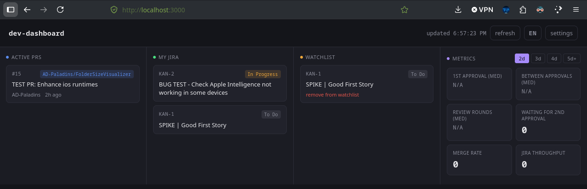

# Dev Dashboard

PWA personal para monitorear PRs de GitHub y tickets de Jira desde un solo lugar.



## Requisitos

- Python 3 (para servir localmente)
- Cuenta de GitHub con un Personal Access Token
- Cuenta de Jira Cloud con API token
- Cuenta de Cloudflare (gratis, para el proxy de Jira)

## Estructura

```
├── index.html          # Layout: 3 paneles (PRs, Jira, Watchlist)
├── main.js             # Entry point: event listeners, SW, interval
├── config.js           # Config y watchlist (localStorage)
├── github.js           # GitHub API (pure, recibe cfg)
├── jira.js             # Jira API (pure, recibe cfg)
├── ui.js               # Rendering, settings modal, refreshAll
├── style.css           # Dark theme, responsive
├── sw.js               # Service worker (caché offline)
├── manifest.json       # PWA manifest
├── icon.svg            # Icono de la app
├── serve.sh            # Script para levantar el server local
└── worker/             # Cloudflare Worker (proxy para Jira)
    ├── index.js
    ├── wrangler.toml
    └── README.md
```

## Paso 1: Levantar el dashboard

```bash
./serve.sh
```

Abrí `http://localhost:8080` en Chrome/Edge. Para instalarlo como PWA, hacé click en el ícono de instalación en la barra de direcciones.

## Paso 2: GitHub

1. Andá a **github.com → Settings → Developer settings → Personal access tokens → Tokens (classic)**
2. **Generate new token (classic)**
3. Nombre: lo que quieras
4. Expiración: la que necesites
5. En **Scopes** marcá **`repo`** (primera checkbox completa)
6. **Generate token** y copialo inmediatamente

En el dashboard, click en **settings** y completá:

| Campo | Valor |
|-------|-------|
| GitHub token | El PAT que generaste |
| Tu usuario de GitHub | Tu username (opcional, filtra PRs tuyos) |
| Repos a monitorear | `owner/repo` separados por coma (ej: `AD-Paladins/FolderSizeVisualizer`) |

**No uses URLs**, solo el formato `owner/repo`.

## Paso 3: Jira

### 3a: Generar API token de Jira

1. Andá a **https://id.atlassian.com/manage-profile/security/api-tokens**
2. **Create API token**
3. Copialo

### 3b: Deployar el proxy CORS

Jira Cloud no permite llamadas directas desde el navegador (CORS). Necesitás un proxy en Cloudflare Workers.

```bash
# Instalá wrangler si no lo tenés
npm install -g wrangler

# Logueate en Cloudflare
wrangler login

# Deployá el worker
cd worker
wrangler deploy
```

Cuando te pida el subdomain, escribí un nombre simple (sin puntos ni URLs):

```
jira-proxy-adpaladines
```

Te va a dar una URL tipo:
```
https://jira-proxy.jira-proxy-adpaladines.workers.dev
```

### 3c: Configurar Jira en el dashboard

En **settings**, completá:

| Campo | Valor |
|-------|-------|
| Dominio | `adpaladines.atlassian.net` (sin `https://`) |
| Email | Tu email de Jira |
| API token | El token que generaste |
| Proxy URL | La URL del worker que deployaste |

## Watchlist

En settings podés agregar tickets específicos para seguir (separados por coma):

```
PROJ-123, PROJ-456
```

Aparecen en el tercer panel. Para quitar un ticket, hacé click en "quitar de watchlist" debajo de la card.

## Cómo funciona

```
Navegador
  ├── GitHub API ← funciona directo (sin CORS)
  └── Jira API ← necesita proxy (Cloudflare Worker)
          │
          └── Worker recibe request → reenvía a Jira Cloud → devuelve respuesta
```

- Todo se guarda en **localStorage** del navegador. Nada sale de tu máquina.
- Auto-refresh cada 5 minutos.
- Service worker cachéa los archivos estáticos para funcionar offline.
- Si Jira falla, la app muestra el error en pantalla (no falla silenciosamente).

## Troubleshooting

| Error | Causa | Solución |
|-------|-------|----------|
| `Jira API 400: Missing jira_domain` | Browser caché viejo | Ctrl+Shift+R |
| `Jira API 410` | Endpoint viejo de Jira | Asegurate de tener la última versión de `app.js` |
| `Jira API 400` con CORS | Proxy no configurado | Verificá que la Proxy URL sea correcta |
| `GitHub API 422` | Usuario o repo incorrecto | Verificá formato `owner/repo` sin URLs |
| `NS_ERROR_INTERCEPTION_FAILED` | CORS de Jira | Necesitás el proxy (Paso 3b) |
